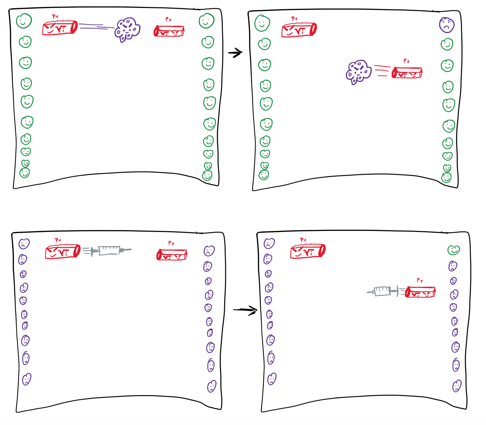

# Coronattack

Das Spiel Coronattack wird im Modul WebE entwickelt. 

Das Spiel basiert auf ein PingPong-Spiel. Es ist ein Dualplayer - Spiel und kann auf verschiedenen Schwierigkeitsgrad (schneller Ball) gespielt werden. 

* Es gibt zwei Modis: 

# Ziele des Spieles

Es muss ein Spiel eröffnet werden oder beigetreten werden. Welcher die Anfrage erhält, kann entweder 
Rejecten oder akzeptieren. Wenn alle Spieler beigetreten sind kann das erste Spiel gestartet werden.

1) mit dem Virus (Ball) müssen die Menschen des Gegenspielers getroffen werden
2) mit der Impfung (Ball) müssen die Menschen wieder genesen werden.

Das Spiel wird auf den Webtechnologien javascript und PostgreSQL erstellt.

Framework Frontend:
- React
Framework Backend:
- Express, nodejs

Entwickler und Autoren:
- Thelogos Baxevanos
- Chantale Gihara

